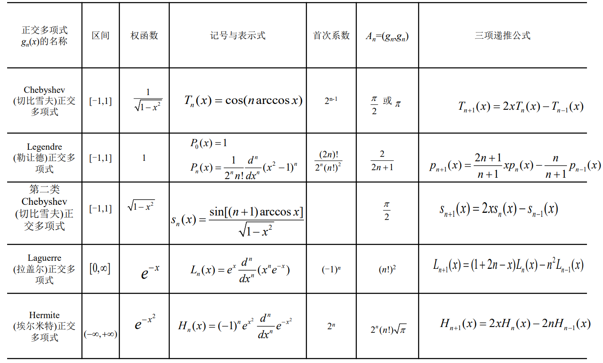

# 数值分析笔记

前言：写这个笔记的初衷只是希望自己借这个机会熟悉一下Markdown的用法，当时并没想到写全，但是没想到最后竟然完成了，还顺道成了我复习时的重点资料哈哈哈。希望这个笔记能对后来的同学有用。（笔记如有错误敬请谅解，$Markdown$ 源码同步上传）

------$Authored$ $by$ $PengOu$

- [数值分析笔记](#数值分析笔记)
- [一、非线性方程的数值解法](#一非线性方程的数值解法)
  - [二分法](#二分法)
  - [迭代法](#迭代法)
    - [单点迭代法](#单点迭代法)
      - [不动点迭代法](#不动点迭代法)
      - [Newton法/切线法](#newton法切线法)
    - [多点迭代法](#多点迭代法)
      - [弦截法/割线法](#弦截法割线法)
    - [重根情形的迭代法](#重根情形的迭代法)
      - [根的重数 $r$ 已知](#根的重数-r-已知)
      - [根的重数未知](#根的重数未知)
- [二、非线性方程组的数值解法](#二非线性方程组的数值解法)
  - [向量、矩阵的范数](#向量矩阵的范数)
    - [向量的范数](#向量的范数)
    - [矩阵的范数](#矩阵的范数)
  - [解线性方程组的直接法](#解线性方程组的直接法)
    - [$Gauss$ 消去法](#gauss-消去法)
  - [矩阵三角分解法](#矩阵三角分解法)
    - [$Doolittle$ 分解法（直接三角分解法）](#doolittle-分解法直接三角分解法)
    - [$Crout$ 分解法](#crout-分解法)
    - [$Cholesky$ 分解法（平方根法）](#cholesky-分解法平方根法)
    - [改进的 $Cholesky$ 分解法（改进的平方根法）](#改进的-cholesky-分解法改进的平方根法)
    - [解三对角方程组的追赶法](#解三对角方程组的追赶法)
  - [矩阵的条件数及误差分析](#矩阵的条件数及误差分析)
  - [解线性方程组的迭代法](#解线性方程组的迭代法)
    - [$Jacobi$ 迭代法](#jacobi-迭代法)
    - [$Gauss-Seidel$ 迭代法](#gauss-seidel-迭代法)
    - [超松弛迭代法（$SOR$ 方法）](#超松弛迭代法sor-方法)
    - [关于解某些特殊方程组迭代法的收敛性](#关于解某些特殊方程组迭代法的收敛性)
- [三、插值与逼近](#三插值与逼近)
  - [多项式插值](#多项式插值)
    - [$Lagrange$ 插值公式](#lagrange-插值公式)
    - [$Newton$ 插值公式](#newton-插值公式)
    - [插值多项式的收敛性和稳定性](#插值多项式的收敛性和稳定性)
    - [分段线性插值](#分段线性插值)
  - [最佳平方逼近](#最佳平方逼近)
    - [正交多项式系](#正交多项式系)
    - [连续函数的最佳平方逼近](#连续函数的最佳平方逼近)
      - [最佳平方逼近函数的构造](#最佳平方逼近函数的构造)
      - [用正交函数系做平方逼近](#用正交函数系做平方逼近)
    - [离散情形的最佳平方逼近](#离散情形的最佳平方逼近)
      - [曲线拟合的最小二乘法](#曲线拟合的最小二乘法)
      - [用正交多项式做最小二乘拟合](#用正交多项式做最小二乘拟合)
- [四、数值积分](#四数值积分)
  - [数值积分的一般问题](#数值积分的一般问题)
    - [数值求积公式](#数值求积公式)
    - [求积公式的代数精度](#求积公式的代数精度)
    - [插值型求积公式](#插值型求积公式)
  - [等距节点的 $Newton-Cotes$ 公式](#等距节点的-newton-cotes-公式)
    - [$Newton-Cotes$ 公式](#newton-cotes-公式)
    - [$Newton-Cotes$ 公式的收敛性](#newton-cotes-公式的收敛性)
    - [$Newton-Cotes$ 公式的数值稳定性](#newton-cotes-公式的数值稳定性)
    - [$Newton-Cotes$ 公式的代数精度](#newton-cotes-公式的代数精度)
    - [$Newton-Cotes$ 公式的余项](#newton-cotes-公式的余项)
    - [复化 $Newton-Cotes$ 公式](#复化-newton-cotes-公式)
      - [复化梯形求积公式](#复化梯形求积公式)
      - [复化抛物线求积公式](#复化抛物线求积公式)
      - [复化 $Cotes$ 公式](#复化-cotes-公式)
  - [$Romberg$ 求积法](#romberg-求积法)
  - [$Gauss$ 求积公式](#gauss-求积公式)
    - [$Gauss$ 求积公式的构造](#gauss-求积公式的构造)
    - [$Gauss$ 求积公式的余项](#gauss-求积公式的余项)
    - [$Gauss$ 求积公式的收敛性](#gauss-求积公式的收敛性)
    - [$Gauss$ 求积公式的数值稳定性](#gauss-求积公式的数值稳定性)
    - [$Gauss−Legendre$ 求积公式](#gausslegendre-求积公式)
    - [$Gauss$ 型求积公式](#gauss-型求积公式)
- [五、常微分方程数值解法](#五常微分方程数值解法)
  - [单步法及基本概念](#单步法及基本概念)
    - [$Euler$ 折线法/矩形法](#euler-折线法矩形法)
    - [梯形法](#梯形法)
    - [改进的 $Euler$ 方法](#改进的-euler-方法)
    - [数值方法精度的衡量准则](#数值方法精度的衡量准则)
    - [$Runge-Kutta$ 方法](#runge-kutta-方法)
    - [单步法的收敛性](#单步法的收敛性)
    - [单步法的绝对稳定性](#单步法的绝对稳定性)
  - [线性多步法](#线性多步法)
    - [线性多步法的基本概念](#线性多步法的基本概念)
    - [线性多步法的构造方法](#线性多步法的构造方法)
      - [基于 $Taylor$ 展开的构造方法 / 待定系数法](#基于-taylor-展开的构造方法--待定系数法)
      - [基于数值积分的构造方法 / 一类多步法 - $Adams$ 方法](#基于数值积分的构造方法--一类多步法---adams-方法)
      - [基于导数近似的构造方法](#基于导数近似的构造方法)
    - [线性多步法的收敛性](#线性多步法的收敛性)
    - [线性多步法的稳定性](#线性多步法的稳定性)
      - [预测-校正方法](#预测-校正方法)

# 一、非线性方程的数值解法

非线性方程 $f(x)=0$ 的根为 $\alpha$.

## 二分法

取最后一个区间的中点 $x_n$ 作为方程根的近似解.

给定小数 $\epsilon>0$, 得:
$$
|\alpha-x_n|<\epsilon\Rightarrow\frac{b-a}{2^{n+1}}<\epsilon\Rightarrow n>\frac{\ln(b-a)-\ln\epsilon}{\ln2}
$$

## 迭代法

定义(全局收敛性, 局部收敛性, 定常迭代, 非定常迭代)

定义(收敛速度) : 记 $e_k=\alpha-x_k$ , 若 $\lim\limits_{k\rightarrow\infty}\displaystyle\frac{|e_{k+1}|}{|e_k|^p}=C\not={0}$ , 则称迭代过程是 $p$ 阶收敛的. 特别地, 当 $p=1$ 时, 称为线性收敛; 当 $p>1$ 时, 称为超线性收敛, 当 $p=2$ 时, 称为平方收敛. $p$ 越大, 收敛越快.

定义(效率指数) : 称 $EI=p^{\frac{1}{\theta}}$ 为效率指数. 其中 $p$ 表示迭代的收敛阶, $θ$ 表示每步迭代的计算量. $EI$ 越大, 计算效率越高.

### 单点迭代法

$x_{k+1}=\varphi_x(k)$

#### 不动点迭代法

$$
f(x)=0\Rightarrow x=\varphi(x)
$$
则建立的迭代公式为:
$$
x_{i+1}=\varphi(x_i), i=0,1,2...
$$
定理(不动点迭代法的全局收敛性) : $x\in[a,b]$ 时, $\varphi(x)\in[a,b]$.
且 $\forall x\in[a,b]$ 时, 有 $|\varphi(x)|\leq L<1$ ( 或  $\forall x_1,x_2\in[a,b]$ 时, 有 $|\varphi(x_1)-\varphi(x_2)|\leq L|x_1-x_2|, L<1$ ) 。则对任意初值 $x_0\in[a,b]$ , 迭代过程收敛于在 $[a,b]$ 上的唯一根.

定理(不动点迭代法的局部收敛性)：若 $\varphi(x)$ 在 $\alpha$ 的领域内有一阶导数，且 $|\varphi'(\alpha)|<1$，那么迭代过程具有局部收敛性。

定理(不动点迭代法的局部收敛阶) : 迭代过程 $x_{k+1}=\varphi_x(k)$ 在 $\alpha$ 的领域内是 $p$ 阶收敛 $\Leftrightarrow\varphi_{(p)}(\alpha)\not={0},\varphi_{(j)}(\alpha)=0,j=1,2,...,p-1$

#### Newton法/切线法

Newton迭代公式:
$$
x_{k+1}=x_k-\frac{f(x_k)}{f'(x_k)}, k=0,1,2,...
$$
若 $\alpha$ 是单根, 则 Newton 法是二阶收敛的, 即 $p=2$.
若 $\alpha$ 是重根, 则 Newton 法是局部线性收敛的, 即 $p=1$.

定理( Newton 迭代法的全局收敛性) : 设 $f(x)$ 在有根区间 $[a,b]$ 上二阶导数存在, 且满足:

1. $f(a)f(b)<0$ ; (保证根的存在)
2. $f'(x)\not={0}, x\in[a, b]$ ; (单调，根唯一)
3. $f''(x)$ 不变号, $x∈[a, b]$ ; (凹向不变)
4. 初值 $x_0\in[a,b]$ , 且使 $f''(x_0)f(x_0)>0$ ; (保证 $𝑥\in[𝑎, 𝑏]$ 时, $\varphi(x)=𝑥-\displaystyle\frac{f(x)}{f'(x)}\in[𝑎,𝑏]$ )

则 $Newton$ 迭代法收敛于 $f(x)=0$ 在 $[a,b]$ 内的唯一根.

$Newton$ 下山法:
$$
x_{k+1}=x_k-\lambda\frac{f(x_k)}{f'(x_k)}, (0<\lambda<1), k=0,1,2,...
$$
其中 $\lambda$ 为下山因子, $\lambda$ 的选取满足: $|f(x_{x-1})|<|f(x_k)|, k=0,1,2,...$ 当 $\lambda\not ={0}$ 时, 是一阶收敛的. 在实际中,可以每次迭代选择不同的下山因子, 即为单点非定常迭代.

### 多点迭代法

$x_{k+1}=\varphi(x_{k-n+1},...,x_{k_2},x_{k-1},x_k)$

#### 弦截法/割线法

在方程 $𝑓(x)=0$ 的根 $\alpha$ 附近任取两初始近似根 $x_0,x_1$, 建立迭代公式:
$$
x_{k+1}=x_k-\displaystyle\frac{x_k-x_{k-1}}{f(x_k)-f(x_{k-1})}f(x_k),k=0,1,...
$$
或:
$$
x_{k+1}=\displaystyle\frac{f(x_k)}{f(x_k)-f(x_{k-1})}x_{k-1}-\displaystyle\frac{f(x_{k-1})}{f(x_k)-f(x_{k-1})}x_k
$$
该方法的收敛阶 $p=\frac{1+\sqrt{5}}{2}\approx1.618$ .

### 重根情形的迭代法

#### 根的重数 $r$ 已知

将 Newton 法修正为求 $r$ 重根的二阶收敛格式:
$$
x_{k+1}=x_k-r\frac{f(x_k)}{f'(x_k)}, k=0,1,2,...
$$

#### 根的重数未知

将 Newton 法修正为求重根的二阶局部收敛格式:
$$
x_{k+1}=x_k-r\frac{u(x_k)}{u'(x_k)}, k=0,1,2,...
$$
其中 $u(x)=\displaystyle\frac{f(x)}{f'(x)}$ . $u(x)$ 的单根就是 $f(x)$ 的 $r$ 重根.

# 二、非线性方程组的数值解法

## 向量、矩阵的范数

### 向量的范数

向量的 $p$-范数：$||x||_p=(\displaystyle\sum \limits_{i=1}^n|x_i|^p)^\frac{1}{p}$

向量的 $\infty$-范数：$||x||_\infty=\max \limits_{1\leq i\leq n}|x_i|$

定理（范数的连续性定理，范数的等价性定理）

### 矩阵的范数

定义（矩阵的范数）：若 $\mathbb{R}^{n\times n}($或$\mathbb{C}^{n\times n})$ 上任一矩阵 $A=(a_{ij})_{n \times n}$，对应一个非负实数 $|A|$，满足以下条件：

1. 非负性：$||A||\geq0$ 且 $||A||=0\Leftrightarrow A=0$
2. 其次性：$||\lambda A||=|\lambda|\cdot||A||$，$\forall \lambda \in \mathbb{R}($或$\mathbb{C})$
3. 三角不等式：$||A+B||\leq||A||+||B||$， $\forall A,B\in \mathbb{R}^{n\times n}($或$\mathbb{C}^{n\times n})$
4. $||AB||\leq ||A||\cdot||B||$，$\forall A,B\in \mathbb{R}^{n\times n}($或$\mathbb{C}^{n\times n})$

则称 $||A||$ 为矩阵 $A$ 的一种范数。

定义（$F$ 范数）：对于实矩阵 $A=(a_{ij})_{n \times n}$，$||A||_F=(\displaystyle \sum \limits_{i=1}^n\sum \limits_{j=1}^n a_{ij}^2)^{\frac{1}{2}}$ 是一种矩阵范数，称为矩阵的 $Frobenius$ 范数，简称矩阵的 $F$ 范数。

定义（矩阵范数与向量范数相容）：对于给定向量范数 $||\cdot||$ 和矩阵范数 $||\cdot||$，如果对任何向量 $x\in \mathbb{R}^n ($ 或 $\mathbb{C}^n)$ 和 $A\in \mathbb{R}^{n×n}($ 或 $\mathbb{C}^{n×n})$，都有不等式$||Ax||\leq||A||\cdot||x||$ 成立，则称所给的矩阵范数与向量范数是相容的。

定义（算子范数/从属范数）：设$x\in \mathbb{R}^n ($ 或 $\mathbb{C}^n)$ 和 $A\in \mathbb{R}^{n×n}($ 或 $\mathbb{C}^{n×n})$，且给定一种向量范数 $||\cdot||_v$，称：
$$
||A||_v=\max \limits_{x\not ={0}}\frac{||Ax||_v}{||x||_v} 或 ||A||_v=\max \limits_{||x||_v=1}||Ax||_v
$$
为矩阵 $A$ 的由向量范数 $||x||_v$ 产生的从属范数或算子范数。且单位矩阵的任一种从属范数都为 $1$，从属范数一定与所给定的向量范数相容。

常见矩阵从属范数：

- 1-范数（列和范数）：$||A||_1=\max \limits_{1 \leq j \leq n}\sum \limits_{i=1}^n|a_{ij}|$
- 2-范数：$||A||_2=\sqrt{\rho(A^HA)}$，$A^H$ 是 $A$ 的共轭转置
- $\infty$-范数（行和范数）：$||A||_{\infty}=\max \limits_{1 \leq i \leq n}\sum \limits_{j=1}^n|a_{ij}|$

定义（矩阵的谱半径）：设 $n$ 阶方阵 $A$ 的特征值为 $λ_1,λ_2,...,λ_n$，则称
$$
\rho (A)=\max \limits_{1\leq i \leq n}|\lambda_i|
$$
为 $A$ 的谱半径。对于任意从属范数 $||\cdot||$， $\rho(A)\leq ||A||$。

## 解线性方程组的直接法

### $Gauss$ 消去法

思想：$Ax=b\Rightarrow Bx=d$（其中 $B$ 是上三角矩阵），求解 $Bx=d$ 。

$Gauss$ 消去法包括消元过程和回代过程两个环节。

$Gauss$ 消去法能一直进行的条件是每一次消元步骤的主元素 $\not ={0}$。其次，若主元素的绝对值很小，容易照成舍入误差的严重扩散，由此引入了列选主元的的 $Gauss$ 消去法：在第 $k$ 步消元前，通过矩阵的行变换，将第 $k$ 列中最大值作为主元。

$\Rightarrow$ 列选主元的Gauss消去法能压制计算过程中舍入误差的增长，减少舍入误差对计算结果的影响。

## 矩阵三角分解法

思想：$Ax=b\xLeftrightarrow {A=LU} LUx=b$（其中 $L$ 是单位下三角矩阵，$U$ 是上三角矩阵。若 $A$ 的所有顺序主子式均不为零，则分解唯一），求解 $\begin{cases}Ly=b\\ Ux=y \end{cases}$

### $Doolittle$ 分解法（直接三角分解法）

$$
A=
\left[
    \begin{matrix}
        a_{11} &a_{12} &\cdots &a_{1n}\\
        a_{12} &a_{22} &\cdots &a_{2n}\\
        \vdots &\vdots &\ddots &\vdots\\
        a_{n1} &a_{n2} &\cdots &a_{nn}\\
    \end{matrix}
\right]
=\left[
    \begin{matrix}
        1   &0  &\cdots &0\\
        l_{21}  &1  &\cdots &0\\
        \vdots  &\vdots &\ddots &\vdots\\
        l_{n1}  &l_{n2} &\cdots &1\\
    \end{matrix}
\right]
\left[
    \begin{matrix}
        u_{11}   &u_{12}  &\cdots &u_{1n}\\
        0  &u_{22}  &\cdots &u_{2n}\\
        \vdots  &\vdots &\ddots &\vdots\\
        0  &0 &\cdots &u_{nn}\\
    \end{matrix}
\right]
=LU
$$
$Doolittle$ 分解法的存储可利用原系数矩阵的存储单元，存储形式：
$$
\left[
    \begin{matrix}
        u_{11}   &u_{12}  &\cdots &u_{1n}\\
        l_{21}  &u_{22}  &\cdots &u_{2n}\\
        \vdots  &\vdots &\ddots &\vdots\\
        l_{n1}  &l_{n2} &\cdots &u_{nn}\\
    \end{matrix}
\right]
\rightarrow A
$$

### $Crout$ 分解法

思路：记 $D=diag(u_{11},u_{22},...,u_{nn})$，那么 $A=LU=(LD)(D^{-1}U)=\hat{L}\hat{U}$（其中 $\hat{L}$ 是下三角矩阵，$\hat{U}$ 是单位上三角矩阵。此分解是唯一的），求解 $\begin{cases}\hat{L}y=b\\ \hat{U}x=y \end{cases}$

$Crout$ 分解法的存储可利用原系数矩阵的存储单元。

具体解法同 $Doolittle$ 分解法。

### $Cholesky$ 分解法（平方根法）

思路：记 $D=diag(u_{11},u_{22},...,u_{nn})$，$\hat{U}=D^{-1}U$，那么 $A=LU=(LD)(D^{-1}U)=LD\hat{U}$（其中 $L$ 是单位下三角矩阵，$\hat{U}$ 是单位上三角矩阵。此分解是唯一的）。如果 $A$ 是对称正定的，则 $\hat{U}=L^{T}\Rightarrow A=LDL^{T}=(LD^{\frac{1}{2}})(LD^{\frac{1}{2}})^T=\overline{L}\cdot\overline{L}^T$，其中 $\overline{L}$ 是下三角阵，求解 $\begin{cases}\overline{L}y=b\\ \overline{L}^Tx=y \end{cases}$

$Cholesky$ 分解法的存储可利用原系数（对称）矩阵的存储单元。

平方根法是用于解系数矩阵为正定矩阵的线性方程组，具体解法同 $Doolittle$ 分解法。

### 改进的 $Cholesky$ 分解法（改进的平方根法）

思路：记 $D=diag(d_{1},d_{2},...,d_{n})$，那么分解 $A=LDL^T$，其中 $L$ 为单位下三角阵，求解 $\begin{cases}Ly=b\\ L^Tx=D^{-1}y \end{cases}$

改进的 $Cholesky$ 分解法的存储可利用原系数（对称）矩阵的存储单元。

### 解三对角方程组的追赶法

设方程组 $Ax=d$，它的系数方阵 $A$ 是一个阶数较高的三对角方阵：
$$
A=\left[
    \begin{matrix}
        b_1 &c_1\\
        a_2 &b_2 &c_2\\
        &a_3 &b_3 &c_3\\
        \\
        &&\ddots&\ddots&\ddots\\
        \\
        &&&a_{n-1} &b_{n-1} &c_{n-1}\\
        &&&&a_n &b_n\\
    \end{matrix}
\right]
$$
且满足条件：

1. $|b_1|>|c_1|>0$
2. $|b_n|>|a_n|>0$
3. $|b_i|\geq|a_i|+|c_i|,a_i,c_i\not ={0},i=2,3,...,n-1$

思路：对 $A$ 进行 $Crout$ 分解：
$$
\left[
    \begin{matrix}
        b_1 &c_1\\
        a_2 &b_2 &c_2\\
        &a_3 &b_3 &c_3\\
        \\
        &&\ddots&\ddots&\ddots\\
        \\
        &&&a_{n-1} &b_{n-1} &c_{n-1}\\
        &&&&a_n &b_n\\
    \end{matrix}
\right]=\left[
    \begin{matrix}
        \alpha_1 \\
        \gamma_2 &\alpha_2 \\
        &\gamma_3 &\alpha_3 \\
        \\
        &&\ddots&\ddots\\
        \\
        &&&\gamma_{n-1} &\alpha_{n-1}\\
        &&&&\gamma_n &\alpha_n\\
    \end{matrix}
\right]\left[
    \begin{matrix}
        1 &\beta_1\\
        &1 &\beta_2\\
        &&1 &\beta_3\\
        \\
        &&&\ddots&\ddots\\
        \\
        &&&&1 &\beta_{n-1}\\
        &&&&&1\\
    \end{matrix}
\right]=\hat{L}\hat{U}
$$
（真正需要计算的是 $\beta_i$，依靠递推计算），求解 $\begin{cases}\hat{L}y=d\\ \hat{U}x=y \end{cases}$

将求系数 $\beta_1\rightarrow\beta_2\rightarrow...\rightarrow\beta_{n-1}$ 及 $y_1\rightarrow y_2\rightarrow...\rightarrow y_{n}$ 的过程称之为追的过程；求 $x_n\rightarrow x_{n-1}\rightarrow...\rightarrow x_{2}\rightarrow x_1$ 的过程称之为赶的过程。

## 矩阵的条件数及误差分析

定义（条件数）：设 $A$ 为非奇异矩阵，称 $cond_v(A)=||A||_v\cdot||A^{-1}||_v$ 为矩阵 $A$ 的条件数，简记为 $cond(A)$。条件数与所取的范数有关，且满足：
$$
cond_v(A)=||A||_v\cdot||A^{-1}||_v\geq||AA^{-1}||=1
$$

  方程组 $Ax=b$ 的右端 $b$ 的扰动对解的影响：
$$
A(x+\delta x)=b+\delta b\Rightarrow\delta x=A^{-1}\delta b\\
\Rightarrow\frac{||\delta x||}{||x||}\leq\frac{||A^{-1}||\cdot||\delta b||}{\displaystyle\frac{||Ax||}{||A||}}=cond(A)\frac{||\delta b||}{||b||}
$$

方程组 $Ax=b$ 的系数阵 $A$ 的扰动对解的影响：
$$
(A+\delta A)(x+\delta x)=b\Rightarrow\delta x=-A^{-1}\delta A(x+\delta x)
$$
假设 $\delta A$ 足够小，使得 $||A^{-1}||\cdot||\delta A||<1$，那么：
$$
\Rightarrow\frac{||\delta x||}{||x||}\leq\frac{||A^{-1}||\cdot||\delta A||}{1-||A^{-1}||\cdot||\delta A||}=\frac{cond(A)\displaystyle\frac{||\delta A||}{||A||}}{1-cond(A)\displaystyle\frac{||\delta A||}{||A||}}
$$

可知 $cond(A)$ 愈小，由 $A($ 或 $b)$ 的相对误差引起的解的相对误差就愈小。因此，量 $cond(A)$ 实际刻画了解对原始数据变化的敏感程度，即刻画了方程组的病态程度。

系数矩阵的条件数较小（接近1）时，方程组是良态的；反之，条件数较大（>>1）时，则方程组是病态的。

定义（误差/剩余向量）：设 $x'$ 是方程组的近似解，则称 $r=b-Ax'$ 为误差(剩余)向量。

近似解 $x'$ 的精度不仅依赖于 $r$ 的大小，而且依赖于的 $A$ 条件数。当 $A$ 是病态时，即使有很小的 $r$，也不能保证 $x'$ 是高精度的近似解：
$$
\frac{||x-x'||}{||x||}\leq cond(A)\cdot\frac{||r||}{||b||}
$$

## 解线性方程组的迭代法

将方程组 $Ax=b$ 改写成等价方程组 $x=Bx+g$，建立迭代公式：
$$
x^{k+1}=Bx^k+g,k=0,1,2,...
$$
称 $B$ 为迭代矩阵。若产生的序列 { $x^{(k)}$ } 对于任意初始向量 $x^{(0)}$ 均收敛于 $x^*$，则称迭代法是收敛的，那么显然 { $x^{(k)}$ } 的极限 $x^*$ 就是方程组的精确解。

定义（误差向量）：称 $\varepsilon^{(k)}=x^{(k)}-x^*,k=0,1,2,...$ 为第 $k$ 步的误差向量，那么：
$$
\varepsilon^{(k+1)}=x^{(k+1)}-x^*=B(x^{(k)}-x^*)=B\varepsilon^{(k)}=B^{k+1}\varepsilon^{(0)}
$$
其中 $\varepsilon^{(0)}=x^{(0)}-x^*$ 为初始误差向量。

引理：设 $B\in \mathbb{K}^{n\times n}，\lim\limits_{k\rightarrow\infty}B^k=0\Leftrightarrow\rho(B)<1$

定理（迭代法的基本收敛定理）：迭代过程 $x^{k+1}=Bx^k+g$ 对于任意初始向量 $x^{(0)}$ 及右端向量 $g$ 均收敛的充分必要条件是迭代矩阵 $B$ 的谱半径 $\rho(B)<1$，并且 $\rho(B)$ 越小，收敛速度越快。（即收敛性与收敛速度与 $g$ 和 $x^{(0)}$ 无关）

定理（迭代法的误差估计）：设 $x^*$ 为方程组 $Ax=b$ 的精确解，若迭代过程 $x^{k+1}=Bx^k+g$ 满足 $||B||<1$，其中 $||\cdot||$ 是某种算子范数，则对于 $\forall x^{(0)},g$ 迭代法收敛，且有如下误差估计式：
$$
||x^{(k)}-x^*||\leq\frac{||B||}{1-||B||}||x^{(k)}-x^{(k-1)}||=\frac{||B||^k}{1-||B||}||x^{(1)}-x^{(0)}||
$$

将方程组 $Ax=b$ 的系数矩阵 $A$ 分解为 $A=L+D+U$，其中 $D=diag(a_{11},a_{22},...,a_{nn})$，$L$ 和 $U$ 分别是 $A$ 的对角线下方元素和上方元素组成的严格下三角阵与严格上三角阵，即：
$$
A=\left[
  \begin{matrix}
  0&0&\cdots&0\\
  a_{21}&0&\cdots&0\\
  \vdots&\vdots&\ddots&\vdots\\
  a_{n1}&a_{n2}&\cdots&0
  \end{matrix}
\right]+\left[
  \begin{matrix}
  a_{11}&0&\cdots&0\\
  0&a_{22}&\cdots&0\\
  \vdots&\vdots&\ddots&\vdots\\
  0&0&\cdots&a_{nn}
  \end{matrix}
\right]+\left[
  \begin{matrix}
  0&a_{21}&\cdots&a_{1n}\\
  0&0&\cdots&a_{2n}\\
  \vdots&\vdots&\ddots&\vdots\\
  0&0&\cdots&0
  \end{matrix}
\right]
$$

### $Jacobi$ 迭代法

若 $D$ 非奇异（即 $a_{ii}\not ={0},i=1,2,...,n$），将方程组改写为 $Dx=-(L+U)x+b\Rightarrow x=-D^{-1}(L+D)x+D^{-1}b$，建立迭代格式：
$$
x^{(k+1)}=-D^{-1}(L+U)x^{(k)}+D^{-1}b,k=0,1,2,...
$$
称为解方程组 $Ax=b$ 的 $Jacobi$ 迭代法。

迭代矩阵 $B_J=-D^{-1}(L+U)=E-D^{-1}A=
\left[
  \begin{matrix}
  0&-\displaystyle\frac{a_{12}}{a_{11}}&\cdots&-\displaystyle\frac{a_{1n}}{a_{11}}\\
  -\displaystyle\frac{a_{21}}{a_{22}}&0&\cdots&-\displaystyle\frac{a_{2n}}{a_{22}}\\
  \vdots&\vdots&\ddots&\vdots\\
  -\displaystyle\frac{a_{n1}}{a_{nn}}&-\displaystyle\frac{a_{n2}}{a_{nn}}&\cdots&0
  \end{matrix}
\right]$

### $Gauss-Seidel$ 迭代法

将方程组改写为 $(D+L)x=-Ux+b\Rightarrow x=-(D+L)^{-1}Ux+(D+L)^{-1}b$，建立迭代格式：
$$
x^{(k+1)}=-(D+L)^{-1}Ux^{(k)}+(D+L)^{-1}b,k=0,1,2,...
$$
称为解方程组 $Ax=b$ 的 $Gauss-Seidel$ 迭代法。

迭代矩阵 $B_G=-(D+L)^{-1}U$

### 超松弛迭代法（$SOR$ 方法）

超松弛迭代法的矩阵表示为：
$$
x^{(k+1)}=(D+\omega L)^{-1}[(1-\omega)D-\omega U]x^{(k)}+\omega(D+\omega L)^{-1}b,k=0,1,2,...
$$
称 $\omega$ 为松弛因子。当 $\omega=1$ 时，就是 $Gauss-Seidel$ 迭代法。

迭代矩阵 $B_{\omega}=(D+\omega L)^{-1}[(1-\omega)D-\omega U]$

定理（超松弛法的收敛性）：超松弛法收敛 $\Rightarrow 0<\omega<2$

### 关于解某些特殊方程组迭代法的收敛性

假设线性方程组为 $Ax=b$，系数矩阵为 $A$，则：
$$
\begin{cases}
Jacobi收敛 \begin{cases}
  \Leftarrow A为按列（按行）严格对角占优\\
  若A是具有正对角线元素的对称矩阵\Leftrightarrow A和2D-A都为对称正定阵\\
  \Leftrightarrow \rho(B_J)<1\\
  \Leftarrow ||B_J||<1（||\cdot||是某种算子范数）
\end{cases}\\
Gauss-Seidel收敛 \begin{cases}
  \Leftarrow A为对称正定阵\\
  \Leftarrow A为按列（按行）严格对角占优\\
  \Leftrightarrow \rho(B_G)<1\\
  \Leftarrow ||B_G||<1（||\cdot||是某种算子范数）
\end{cases}\\
SOR收敛 \begin{cases}
  \Leftarrow A为对称正定阵，且0<\omega<2\\
  \Leftarrow A为按列（按行）严格对角占优，且0<\omega\leq1\\
  \Leftrightarrow \rho(B_{\omega})<1\\
  \Leftarrow ||B_{\omega}||<1（||\cdot||是某种算子范数）\\
  \Rightarrow 0<\omega<2
\end{cases}\\
\end{cases}
$$

# 三、插值与逼近

## 多项式插值

定义（插值）：已知函数 $y=f(x)$ 在 $[a, b]$ 中的 $n+1$ 个互异点 $x_{0},x_{1},...,x_{n}$ 上的函数值分别为 $f(x_{0}),f(x_{1}),...,f(x_{n})$，构造一个简单的函数 $P(x)$，满足条件 $P(x_{i})=f(x_{i})(i=0,1,...n)$，称这类问题为插值问题，称 $P(x)$ 为函数 $f(x)$ 的插值函数，$f(x)$ 为被插值函数，点 $x_{0},x_{1},...,x_{n}$ 为插值节点，称 $P(x_{i})=f(x_{i})$ 为插值条件。

定理（存在唯一性）：记 $M_n$ 为次数 $\leq n$ 的多项式集合，构造 $L_n(x)\in M_n$ 且满足条件 $L_n(x_i)=f(x_i),i=0,1,...,n$，那么 $L_n(x)$ 存在且唯一的。

### $Lagrange$ 插值公式

定义（$Lagrange$ 插值基函数/插值多项式）：设
$$
l_i(x)=\displaystyle\frac{(x-x_0)(x-x_1)\cdots(x-x_{i-1})(x-x_{i+1})\cdots(x-x_n)}{(x_i-x_0)(x_i-x_1)\cdots(x_i-x_{i-1})(x_i-x_{i+1})\cdots(x_i-x_n)}
$$
满足$l_i(x_j)=\begin{cases}
  1&i=j\\
  0&i\not={j}\\
\end{cases}$
，那么可得：
$$
L_n(x)=\displaystyle\sum_{i=0}^nf(x_i)l_i(x)=\sum_{i=0}^nf(x_i)\prod_{j=0,j\not ={i}}^n\frac{x-x_j}{x_i-x_j}
$$
称 $l_i(x),i=1,2,...,n$ 为 $Lagrange$ 插值基函数，$L_n(x)$ 为$Lagrange$ 插值多项式。记 $p_{n+1}(x)=(x-x_0)(x-x_1)\cdots(x-x_n)$，那么：
$$
L_n(x)=\displaystyle\sum_{i=0}^n\frac{p_{n+1}(x)}{(x-x_i)p'_{n+1}(x_i)}f(x_i)
$$
特别的称 $L_1(x)$ 即一次插值为线性插值，称 $L_2(x)$ 即二次插值为抛物插值。

定理（$Lagrange$ 插值多项式的余项）：设 $Ln(x)$ 是n次 $Lagrange$ 插值多项式，若 $f(x)\in C^n[a ,b]$，且在 $(a,b)$ 内存在 $n+1$ 阶导数，其中 $[a,b]$ 是包含点 $x_0,x_1,...,x_n$ 的一区间，则对任意给定的 $x\in[a,b]$，总存在一点 $\xi\in(a,b)$（依赖于 $x$）使：
$$
E(x)=f(x)-L_n(x)=\displaystyle\frac{f^{(n+1)}(\xi)}{(n+1)!}(x-x_0)(x-x_1)\cdots(x-x_n)\leq\frac{|p_{n+1}(x)|}{(n+1)!}\max_{x\in[a,b]}|f^{(n+1)}(x)|
$$

### $Newton$ 插值公式

定义（差商）：规定 $f(x_i)$ 为 $f(x)$ 在点 $x_i$ 处的零阶差商；那么称 $f[x_i,x_j]=\displaystyle\frac{f(x_i)-f(x_j)}{x_i-x_j}$ 为 $f(x)$ 在点 $x_i,x_j$ 处的一阶差商；一般的，称：
$$
f[x_0,x_1,\cdots,x_k]=\displaystyle\frac{f[x_0,x_1,\cdots,x_{k-2},x_k]-f[x_0,x_1,\cdots,x_{k-1}]}{x_k-x_{k-1}}
$$
为函数 $f(x)$ 在点 $x_0,x_1,\cdots,x_k$ 处的 $k$ 阶差商。

定理（差商的性质）：

1. 差商关于所含节点是对称的，即与节点位置无关，即 $f[x_0,x_1,\cdots,x_n]=\displaystyle\sum_{i=0}^n\displaystyle\frac{f(x_i)}{p'_{n+1}(x_i)}$
2. $f[x_0,x_1,\cdots,x_n]=\displaystyle\frac{f^{(n)}(\xi)}{n!},\xi\in(a,b)$
3. $n$ 次多项式 $P(x)$ 的 $k$ 阶差商 $P[x_0,x_1,...,x_{k-1},x_n]$ 当 $k\leq n$ 时为一个 $n-k$ 次多项式；当 $k>n$ 时恒为零。

定义（$Newton$ 插值多项式/余项）：
$$
f(x)=f(x_0)+f[x_0,x]\cdot(x-x_0)\\
f[x_0,x]=f[x_0,x_1]+f[x_0,x_1,x]\cdot(x-x_1)\\
\vdots\\
f[x_0,x_1,...,x_{n-1},x]=f[x_0,x_1,...,x_n]+f[x_0,x_1,...,x_n,x]\cdot(x-x_n)\\
\xRightarrow{反复将后一式代入前一式}f(x)=f(x_0)+f[x_0,x_1]\cdot(x-x_0)+f[x_0,x_1,x_2]\cdot(x-x_0)(x-x_1)\\+...+f[x_0,x_1,...,x_{n}]\cdot(x-x_0)(x-x_1)...(x-x_{n-1})+f[x_0,x_1,...,x_n,x]\cdot(x-x_0)(x-x_1)...(x-x_n)
$$

以上为推导过程，如下记：
$$
N_n(x)=f(x)=f(x_0)+f[x_0,x]\cdot(x-x_0)+f[x_0,x_1,x]\cdot(x-x_0)(x-x_1)\\
+...+f[x_0,x_1,...,x_n]\cdot(x-x_0)(x-x_1)...(x-x_{n-1})\\
E(x)=f(x)-N_n(x)=f[x_0,x_1,...,x_n,x]\cdot(x-x_0)(x-x_1)...(x-x_n)
$$
显然 $N_n(x)$ 为次数 $\leq n$ 的多项式，且满足插值条件 $N_n(x_i)=f(x_i),i=0,1,...,n$，称 $N_n(x)$ 为 $Newton$ 插值多项式，称 $E(x)$ 为 $Newton$ 插值多项式的余项。

由定理存在唯一性知，相同插值节点的 $Lagrange$ 插值多项式和 $Newton$ 插值多项式是同一个多项式,故它们的余项相等，即得 $f[x_0,x_1,...,x_n]=\displaystyle\frac{f^{(n)}(\xi)}{n!},\xi\in(a,b)$，比较两种插值多项式id首项系数即证差商性质1。

$Lagrange$ 插值多项式形式对称，易于编程，但无继承性。$Newton$ 插值多项式则具有继承性。

### 插值多项式的收敛性和稳定性

定义（一致收敛性）：设 $y_n(x)$ 为 $n+1$ 个插值节点的插值多项式，如果 $\forall\varepsilon>0$，存在正整数 $N$，当 $n>N$ 时，对所有 $x\in[a,b]$，有 $|f(x)-y_n(x)|<\varepsilon$ 成立，则称 $y_n(x)$ 一致收敛于 $f(x)$。

由 $Rouge$ 现象引发的思考：

1. 节点的不断加密，构造出的高次插值多项式并不一定能很好地逼近函数 $f(x)$，所以在实际应用中，高次多项式很少被采用。
2. 如果不是在 $[-1,1]$ 区间上直接构造插值多项式，而是将区间 $[-1,1]$ 等分为若干个小区间，在每一个小区间上分别作低次插值来避免 $Runge$ 现象，这就是分段插值的思想。
3. 既然 $L_n(x)$ 发生激烈的变化，是否应该考虑修改插值条件. 对插值函数的导数进行限制, 这便是 $Hermite$ 插值的思想.

定理（$Faber$）：略，涉及插值节点无穷三角阵

线性插值是数值稳定的；高次（$n\geq2$）插值是数值不稳定的。

### 分段线性插值

设在区间 $[a,b]$ 上给定 $n+1$ 个插值节点 $a=x_0<x_1< ...<x_n=b$ 上的函数值 $f(x_0),f(x_1),...,f(x_n)$，求作一个插值函数 $\varphi_x)$，具有性质：

1. $\varphi_{x_i}=f(x_i)(i=0,1,2,...n)$；
2. $\varphi(x)$ 在每个小区间 $[x_i,x_{i+1}](i=0,1,...,n-1)$ 上是线性函数；

$$
\varphi(x)=f(x_i)\frac{x-x_{i+1}}{x_i-x_{i+1}}+f(x_{i+1})\frac{x-x_{i}}{x_{i+1}-x_i},x\in[x_i,x_{i+1}]
$$

## 最佳平方逼近

### 正交多项式系

定义（权函数）：若 $\rho(x)$ 为有限或无限区间 $[a,b]$ 上的函数，且满足：

1. $\rho(x)\geq0, x\in[a,b]$；
2. 对 $k=0,1,2,...,\int_a^b\rho(x)x^kdx$ 都存在；
3. 对非负的 $f(x)\in C[a,b]$，若 $\int_a^b\rho(x)f(x)dx$ 有 $f(x)\equiv0$；
则称 $\rho(x)$ 为 $[a,b]$ 上的权函数。

定义（带权 $\rho(x)$ 正交）：设 $f(x),g(x)\in C[a,b]$，$ρ(x)$ 为 $[a,b]$ 上的权函数，若内积
$$
(f,g)=\int_a^b\rho(x)f(x)g(x)dx=0
$$
则称 $f(x)$ 与 $g(x)$ 在 $[a,b]$ 上带权 $ρ(x)$ 正交。

定义（带权 $\rho(x)$ 的正交函数系）：若函数序列 $\{\varphi\}_{i=0}^{\infty}$ 在 $[a,b]$ 上带权 $\rho(x)$ 两两正交，即则称 $\{\varphi\}_{i=0}^{\infty}$ 是区间 $[a,b]$ 上带权 $\rho(x)$ 的正交函数系。

定义（带权 $\rho(x)$ 的正交多项式系）：若 $\varphi_n(x)$ 是首项系数非零的n次多项式，则称 $\{\varphi\}_{i=0}^{\infty}$ 是区间 $[a,b]$ 上带权 $\rho(x)$ 的正交多项式系。

定义（带权 $\rho(x)$ 的 $n$ 次正交多项式）：称 $\varphi_n(x)$ 是区间 $[a,b]$ 上带权 $\rho(x)$ 的 $n$ 次正交多项式。

定理（正交多项式系的生成）：只要给定区间 $[a,b]$ 及权函数$\rho(x)$，可由线性无关的幂函数族 $\{x^n\}$，利用正交化方法构造出正交多项式系序列 $\{\varphi\}_{i=0}^{\infty}$：
$$
\varphi_0(x)=1\\
\varphi_n(x)=x^n-\sum_{k=1}^{n-1}\frac{(x^n,\varphi_k)}{(\varphi_k,\varphi_k)}\varphi_k(x),n=1,2,...
$$
并且得到的正交多项式序列具有以下性质：

1. $\varphi_n(x)$ 是最高次项系数为 $1$ 的 $n$ 次多项式；
2. 任意 $n$ 次多项式均可表示为 $\varphi_0(x),\varphi_1(x),...,\varphi_n(x)$ 的线性组合；
3. 当 $k\not ={j}$ 时, $(\varphi_j ,\varphi_k)=0$，且 $\varphi_k(x)$ 与任意次数小于 $k$ 的多项式正交；
4. 成立递推关系式：
$\varphi_0(x)=1,\varphi_1(x)=x-\alpha_0,...,\varphi_{n+1}(x)=(x-\alpha_n)\varphi_n(x)-\beta_n\varphi_{n-1}(x),n=1,2,...$，其中 $\alpha_n=\displaystyle\frac{(x\varphi_n,\varphi_n)}{(\varphi_n,\varphi_n)},n=0,1,...;\beta_n=\displaystyle\frac{(\varphi_n,\varphi_n)}{(\varphi_{n-1},\varphi_{n-1})},n=1,2,...$；
5. 若 $\{\varphi\}_{i=0}^{\infty}$ 是在 $[a,b]$ 上带权 $\rho(x)$ 的正交多项式系，则 $\varphi_n(x) (n\geq1)$ 的 $n$ 个根都是区间 $(a,b)$ 内的单重实根；

常用的正交多项多有 $Chebyshev$ 多项式，$Legendre$多项式，$Laguerre$ 多项式和 $Hermite$ 多项式，第二类 $Chebyshev$ 多项式，将它们归纳为下表:

### 连续函数的最佳平方逼近

#### 最佳平方逼近函数的构造

设 $f(x)\in C[a,b],\varphi_0(x),\varphi_1(x),...,\varphi_n(x)$ 为 $[a,b]$ 上的一组线性无关的函数，$\Phi=Span\{\varphi_0(x),\varphi_1(x),...,\varphi_n(x)\}$，则对任意 $\varphi_(x)\in\varPhi$，有：
$$
\varphi(x)=\sum_{i=0}^na_i\varphi_i(x)
$$
寻求 $\varphi(x)\in\Phi$ 逼近 $f(x)\in C[a,b]$, 满足：
$$
||f-\varphi||_2^2\eqqcolon \int_a^b\rho(x) [f(x)-\varphi(x)]^2dx=min
$$

定义（最佳平方逼近函数）：各符号意义同上，若 $\exist \varphi^*(x)\in \Phi,s.t.||f-\varphi^*||^2_2=\min\limits_{\varphi\in\Phi}||f-\varphi||^2_2=\min\limits_{\varphi\in\Phi}\int_a^b\rho(x) [f(x)-\varphi(x)]^2dx$，则称 $\varphi^*(x)$ 是 $f(x)$ 是在 $\Phi$ 中的最佳平方逼近函数。

求解$\varphi^*(x)$：求 $\varphi^*(x)\in\Phi$ 等价于求多元函数 $F(a_0,a_1,...,a_n)=\int_a^b\rho(x) [\sum\limits_{i=0}^n a_i \varphi_i(x)-f(x)]^2dx$ 的极小值
$$
\Rightarrow\frac{\partial F}{\partial a_k}=2\int_a^b\rho(x) [\sum\limits_{i=0}^n a_i \varphi_i(x)-f(x)]\varphi_k(x)dx=0,k=0,1,...,n\\
\Rightarrow\sum\limits_{i=0}^n(\varphi_i,\varphi_k)a_i=(f,\varphi_k),k=0,1,...,n\cdots(*)
$$
$\varphi_0(x),\varphi_1(x),...,\varphi_n(x)$ 线性无关，法方程 $(*)$ 的系数矩阵非奇异，那么方程组有唯一解 $a_i=a_i^*,i=0,1,...,n\Rightarrow\varphi^*(x)=\sum\limits_{i=0}^n a_i^*\varphi_i(x)$。

定义（最佳平方逼近误差）：记 $\delta(x)=f(x)-\varphi^*(x)\xRightarrow{(f-\varphi^*,\varphi^*)=0}||\delta||_2^2=||f-\varphi^*||_2^2=(f-\varphi^*,f-\varphi^*)=(f,f)-(\varphi^*,f)=||f||^2-\sum\limits_{i=0}^n a_i^*(\varphi_i(x),f)$，称 $||\delta||_2^2$ 为最佳平方逼近误差，称 $||\delta||_2$ 为均方误差。

特例：取$f(x)\in C[0,1],[a,b]=[0,1],\rho(x)=1,\varphi_i(x)=x^i,i=0,1,...,n,\Phi=Span\{1,x,x^2,...,x^n\}$，此时法方程 $(*)$ 的系数矩阵为 $Hilbert$ 矩阵 $H_n$，当 $n\geq 3$ 时是病态的，故只适用于 $n\leq 2$ 的情形。对 $n\geq 3$ 可用正交多项式作 $\Phi$ 的基求解最佳平方逼近多项式。

#### 用正交函数系做平方逼近

$$
\sum\limits_{i=0}^n(\varphi_i,\varphi_k)a_i=(f,\varphi_k),k=0,1,...,n\xRightarrow{(\varphi_i,\varphi_j)=0,i\not ={j}}a_i^*=\frac{(f,\varphi_i)}{(\varphi_i,\varphi_i)}\\
\Rightarrow\varphi^*(x)=\sum\limits_{i=0}^n \frac{(f,\varphi_i)}{(\varphi_i,\varphi_i)}\varphi_i(x)
$$
并且当取正交多项式作为 $\Phi$ 的基时，$\lim\limits_{n\rightarrow\infty}||f-\varphi_n^*||_2=0$

### 离散情形的最佳平方逼近

#### 曲线拟合的最小二乘法

定义（曲线拟合的最小二乘法）：求 $\varphi^*(x)\in \Phi,s.t.||f-\varphi^*||^2_2=\min\limits_{\varphi\in\Phi}||f-\varphi||^2_2=\min\limits_{\varphi\in\Phi}\sum\limits_{i=0}^m\rho(x_i) [f(x_i)-\varphi(x_i)]^2$，称之为曲线拟合的最小二乘法。

求解$\varphi^*(x)$：求 $\varphi^*(x)\in\Phi$ 等价于求多元函数 $F(a_0,a_1,...,a_n)=\sum\limits_{i=0}^m\rho(x_i) [\sum\limits_{j=0}^n a_j \varphi_j(x_i)-f(x_i)]^2$ 的极小值
$$
\Rightarrow\frac{\partial F}{\partial a_k}=2\sum\limits_{i=0}^m\rho(x_i) [\sum\limits_{j=0}^n a_j \varphi_j(x_i)-f(x_i)]\varphi_k(x_i)=0,k=0,1,...,n\\
\Rightarrow\sum\limits_{j=0}^n(\varphi_j,\varphi_k)a_j=(f,\varphi_k),k=0,1,...,n\\
\begin{cases}
  (\varphi_j,\varphi_k)=\sum\limits_{i=0}^n\rho(x_i)\varphi_j(x_i)\varphi_k(x_i)\\
  (f,\varphi_k)=\sum\limits_{i=0}^n\rho(x_i)f(x_i)\varphi_k(x_i)
\end{cases}
$$
求解方程组有 $a_k=a_k^*,k=0,1,...,n\Rightarrow\varphi^*(x)=\sum\limits_{k=0}^n a_k^*\varphi_k(x)$。

常取 $\Phi=Span\{1,x,x^2,...,x^n\}$ 获得唯一最小二乘逼近，但当 $n$ 较大时，法方程病态，可采用正交多项式。

#### 用正交多项式做最小二乘拟合

当数学模型为多项式时，可根据正交性条件，用点集 $\{x_i\}_0^m$ 由递推公式（即上述正交多项式序列性质4）构造正交多项式，那么：
$$
\sum\limits_{i=0}^n(\varphi_i,\varphi_k)a_i=(f,\varphi_k),k=0,1,...,n\xRightarrow{(\varphi_i,\varphi_j)=0,i\not ={j}}a_i^*=\frac{(f,\varphi_i)}{(\varphi_i,\varphi_i)}\\
\Rightarrow\varphi^*(x)=\sum\limits_{i=0}^n \frac{(f,\varphi_i)}{(\varphi_i,\varphi_i)}\varphi_i(x)
$$
以 $||\delta||^2_2=\lim\limits_{n\rightarrow\infty}||f-\varphi_n^*||_2\leq \varepsilon$ 控制算法终止或 $n$ 事先给定。

# 四、数值积分

## 数值积分的一般问题

### 数值求积公式

定义（机械求积公式，求积节点，求积函数，求积公式的余项）：
$$
I(f)=\int_a^b f(x)dx\approx\sum_{i=0}^nH_if(x_i)\\
E(f)=\int_a^b f(x)dx-\sum_{i=0}^nH_if(x_i)\\
H_i与f(x)无关,x_i\in[a,b],i=0,1,...,n
$$

### 求积公式的代数精度

定义（求积公式的代数精度）：若求积公式对所有次数不超过 $m$ 的多项式都精确成立，而对于某个 $m+1$ 次多项式不能精确成立，则称此求积公式具有 $m$ 次代数精度（或称该公式是 $m$ 阶的）$\Leftrightarrow f(x)=1,x,x^2,...,x^m$ 均精确成立，而对 $f(x)=x^{m+1}$ 不精确成立。

**代数精度的概念是衡量求积公式精确性的标准**。

### 插值型求积公式

定义（插值型求积公式）：给定互异点 $x_0,x_1,...,x_n$ 作 $f(x)$ 的 $n$ 次 $Lagrange$ 插值多项式，则：$\displaystyle\int_a^b f(x)dx\approx\sum\limits_{i=0}^n(\int_a^b l_i(x)dx)f(x_i)$，求积函数 $H_i=\displaystyle\int_a^b l_i(x)dx=\displaystyle\int_a^b \prod\limits_{j=0,j\not ={i}}^n\frac{x-x_j}{x_i-x_j} dx,i=0,1,...,n$，此时称为插值型求积公式。

余项 $E(f)=\displaystyle\int_a^b \frac{f^{(n+1)}(\xi)}{(n+1)!}p_{(n+1)}(x)dx$

定理：求积公式 $I(f)=\int_a^b f(x)dx\approx \sum_{i=0}^nH_if(x_i)$ 至少具有 $n$ 次代数精度 $\Leftrightarrow$ 求积公式是插值型的。

## 等距节点的 $Newton-Cotes$ 公式

### $Newton-Cotes$ 公式

将区间 $[a,b] n$ 等分，分点为 $x_i=a+ih,i=0,1,...,n,h=\frac{b-a}{n}$，以此作 $n$ 次插值多项式：
$$
L_n(x)=\sum_{i=0}^nf(x_i)l_i(x)\\
\int_a^b f(x)dx\approx\sum\limits_{i=0}^n(\int_a^b l_i(x)dx)f(x_i)\\
H_i=\int_a^b l_i(x)dx,i=0,1,...,n\\
\xRightarrow{x=a+th} H_i=\int_a^b \prod\limits_{j=0,j\not ={i}}^n\frac{x-x_j}{x_i-x_j} dx=\frac{(-1)^{n-i}h}{i!(n-i)!}\int_0^nt(t-1)\cdots(t-i+1)(t-i-1)\cdots(t-n)dt\\
记C_i^{(n)}=\frac{(-1)^{n-i}}{n\cdot i!(n-i)!}\int_0^n \prod_{j=0,j\not ={i}}^n (t-j) dt 为柯特斯(Cotes)系数\\
\Rightarrow H_i=(b-a)C_i^{(n)}\\
\Rightarrow \int_a^b f(x)dx\approx (b-a) \sum\limits_{i=0}^nC_i^{(n)}f(x_i)\rightarrow此即为 n 阶Newton-Cotes公式
$$

当 $n=1$ 时，$Newton-Cotes$ 公式为梯形求积公式 $\int_a^bf(x)dx\approx\frac{b-a}{2}[f(a)+f(b)]=T$，几何意义为用梯形面积近似代替曲边梯形面积。

当 $n=2$ 时，$Newton-Cotes$ 公式为抛物线 $(Simpson)$ 求积公式 $\int_a^bf(x)dx\approx\frac{b-a}{6}[f(a)+4f(\frac{a+b}{2})+f(b)]=S$

当 $n=4$ 时，$Newton-Cotes$ 公式为 $Cotes$ 公式。

其它情形可通过查 $Cotes$ 系数表，给出具体公式。

**并且 $\sum\limits_{i=0}^nC_i^{(n)}=1$恒成立**

### $Newton-Cotes$ 公式的收敛性

定理：对于 $n+1$ 个节点的 $Newton-Cotes$ 公式的求积系数 $H_k$，当 $n\rightarrow\infty$时，数列 $\sum_{k=0}^n|H_k|$ 无限放大。

定理：如果当 $n\rightarrow\infty$ 时，与插值型求积公式相应的数列 $\sum_{k=0}^n|H_K|$ 无限放大，则有函数 $f(x)\in C[a,b]$，使得数列 $\sum_{k=0}^nH_kf(x_k),n=1,2,...$ 不收敛于 $\int_a^bf(x)dx$

**此定理说明 $Newton-Cotes$ 公式并不总是收敛于积分的真值。**

### $Newton-Cotes$ 公式的数值稳定性

设精确值为 $f(x_j)$ 的计算值为 $\widetilde{f}(x_j)$，且 $|f(x_j)-\widetilde{f}(x_j)|\leq \varepsilon$
$$
\Rightarrow |\sum_{i=0}^n H_i f(x_j)-\sum_{i=0}^n H_i \widetilde{f}(x_j)|\leq \sum_{i=0}^n |H_i||f(x_j)-\widetilde{f}(x_j)| \leq\varepsilon\sum_{i=0}^n |H_i|
$$

若每个 $H_i$ 都为正，则 $\varepsilon\sum_{i=0}^n |H_i|=(b-a)\varepsilon$，此时数值计算是稳定的。

若 $H_i$ 有正有负，则 $\sum_{i=0}^n |H_i|>(b-a)$，且随 $n$ 的增大无限放大，这时数值计算是不稳定的。

**当 $n=8$ 时，$Newton-Cotes$ 公式中求积系数出现负数。实际计算并不用高阶 $Newton-Cotes$ 公式，一方面余项含高阶导数，另一方面其收敛性、稳定性都差。**

### $Newton-Cotes$ 公式的代数精度

对于 $n$ 阶的 $Newton-Cotes$ 公式：

- 当 $n$ 为奇数时，至少具有 $n$ 次代数精度；
- 当 $n$ 为偶数时，至少具有 $n+1$ 次代数精度。

梯形求积公式具有 $1$ 次代数精度。

抛物线求积公式具有 $3$ 次代数精度。

### $Newton-Cotes$ 公式的余项

对于 $n$ 阶的 $Newton-Cotes$ 公式：

- 当 $n$ 为奇数时，若 $f(x)\in C^{n+1}[a,b]$，则 $E(f)=\displaystyle \frac{f^{(n+1)}(\xi)}{(n+1)!} \int_a^b p_{(n+1)}(x)dx,\xi \in (a,b)$
- 当 $n$ 为偶数时，若 $f(x)\in C^{n+2}[a,b]$，则 $E(f)=\displaystyle \frac{f^{(n+2)}(\xi)}{(n+2)!} \int_a^b xp_{(n+1)}(x)dx,\xi \in (a,b)$

梯形求积公式的余项 $E_T(f)=-\frac{(b-a)^3}{12}f''(\eta),\eta\in(a,b)$

抛物线求积公式的余项 $E_S(f)=-\frac{(b-a)^5}{2880}f^{(4)}(\eta),\eta\in(a,b)$

### 复化 $Newton-Cotes$ 公式

#### 复化梯形求积公式

将区间 $[a,b] n$ 等分，分点为 $x_i=a+ih,i=0,1,...,n,h=\frac{b-a}{n}$，在每个小区间 $[x_k,x_{k+1}]$ 上利用梯形求积公式：
$$
\int_a^bf(x)dx=\sum_{k=0}^{n-1}\int_{x_k}^{x_{k+1}}f(x)dx\approx\sum_{k=0}^{n-1}\frac{x_{k+1}-x_k}{2}[f(x_k)+f(x_{k+1})]\\
=\frac{h}{2}[f(a)+f(b)+2\sum_{k=1}^{n-1}f(a+kh)]=T_n
$$
将区间 $[a,b] 2n$ 等分:
$$
T_{2n}\xlongequal{\displaystyle x_{(k+\frac{1}{2})}=\frac{x_k+x_{k+1}}{2}}\frac{h}{4}\sum_{k=0}^{n-1}[f(x_k)+2f(x_{k+\frac{1}{2}})+f(x_{k+1})]\\
\xRightarrow{\displaystyle令 U_n=h\sum_{k=0}^{n-1}f(x_{k+\frac{1}{2}})} T_{2n}=\frac{1}{2}(T_n+U_n)
$$
复化梯形求积公式的误差 $E(f;T_n)=-\frac{b-a}{12}h^2f''(\eta),\eta\in(a,b)$

$\lim\limits_{n\rightarrow\infty}T_n=\int_a^bf(x)dx\Rightarrow$ **复化梯形积分求积公式是收敛的**

$T_n$ 的求积系数均为正 $\Rightarrow$ **复化梯形积分求积公式是数值稳定的**

#### 复化抛物线求积公式

将区间 $[a,b] n$ 等分，分点为 $x_i=a+ih,i=0,1,...,n,h=\frac{b-a}{n}$，在每个小区间 $[x_k,x_{k+1}]$ 上利用抛物线求积公式：
$$
\int_a^bf(x)dx=\sum_{k=0}^{n-1}\int_{x_k}^{x_{k+1}}f(x)dx\approx\frac{h}{6}\sum_{k=0}^{n-1}[f(x_k)+4f(x_{k+\frac{1}{2}})+f(x_{k+1})]\\
=\frac{h}{6}[f(a)+4\sum_{k=0}^{n-1}f(x_{k+\frac{1}{2}})+2\sum_{k=1}^{n-1}f(x_k)+f(b)]=S_n,x_{(k+\frac{1}{2})}=\frac{x_k+x_{k+1}}{2}\\
\Rightarrow S_n=\frac{1}{3}T_n+\frac{2}{3}U_n=\frac{4T_{2n}-T_n}{4-1}
$$
复化抛物线求积公式的误差 $E(f;S_n)=-\frac{(b-a)}{2880}h^4f^{(4)}(\eta),\eta\in(a,b)$

$\lim\limits_{n\rightarrow\infty}S_n=\int_a^bf(x)dx\Rightarrow$ **复化抛物线积分求积公式是收敛的**

$S_n$ 的求积系数均为正 $\Rightarrow$ **复化抛物线积分求积公式是数值稳定的**

#### 复化 $Cotes$ 公式

$$
C_n=\frac{4^2S_{2n}-S_n}{4^2-1}
$$

复化 $Cotes$ 公式的误差 $E(f;C_n)=-\frac{2(b-a)}{945}(\frac{h}{4})^6f^{(6)}(\eta),\eta\in(a,b)$

**复化 $Cotes$ 公式是收敛的**

**复化 $Cotes$ 公式是数值稳定的**

## $Romberg$ 求积法

$Romberg$ 公式：
$$
\frac{4^3C_{2n}-C_n}{4^3-1}=R_n\rightarrow O(h^8)
$$

$Romberg$ 方法：将区间 $[a,b]$ 依次作 $2^0,2^1,2^2,...$ 等分，按复化梯形求积公式算得的值相应地记为 $T_0^{(0)},T_0^{(1)},T_0^{(2)},...$，由公式：$\displaystyle T_m^{(k)}=\frac{4^mT_{m-1}^{(k+1)}-T_{m-1}^{(k)}}{4^m-1}$，递推计算 $T$ 数表，用 $T_m^{(k)}$ 或 $T_m^{(0)}$ 作为定积分的近似值。

$T$ 数表中元素 $T_m^{(k)}$ 相应的求积公式具有 $2m+1$ 次代数精度，且第 $m$ 列的元素收敛于积分真值。

## $Gauss$ 求积公式

定义：若求积公式 $\displaystyle \int_a^b f(x)dx\approx\sum^n_{k=0}H_kf(x_k)$ 具有 $2n+1$ 次代数精度，则称该求积公式为 $Gauss$ 求积公式，相应的求积节点称为 $Gauss$ 点。

**$Gauss$ 求积公式一定是插值型求积公式**

### $Gauss$ 求积公式的构造

定理：插值型求积公式 $\displaystyle \int_a^b f(x)dx\approx\sum^n_{k=0}H_kf(x_k)$ 是 $Gauss$ 求积公式的充分必要条件是：以其节点为零点的 $n+1$ 次多项式 $p_{n+1}(x)=(x-x_0)(x-x_1)...(x-x_n)$ 在 $[a,b]$ 上关于权函数 $\rho(x)\equiv1$ 与一切次数 $\leq n$ 的多项式 $q_n(x)$ 正交，即 $\int_a^bq_n(x)p_{n+1}(x)dx=0$

定理：$n+1$ 个节点的机械求积公式 $\int_a^b f(x)dx\approx\sum^n_{k=0}H_kf(x_k)$ 的代数精度不能超过 $2n+1$

定理：$n+1$ 个节点的插值型求积公式的代数精度至少为 $n$，最高为 $2n+1$

### $Gauss$ 求积公式的余项

利用 $Hermite$ 插值公式与积分中值定理得：
$$
E(f)=\int_a^b\frac{f^{(2n+2)}(\xi)}{(2n+2)!}p_{n+1}^2(x)dx=\frac{f^{(2n+2)}(\eta)}{(2n+2)!}\int_a^bp_{n+1}^2(x)dx
$$

### $Gauss$ 求积公式的收敛性

定理：若 $f(x)\in C[a,b]$，则 $Gauss$ 求积公式是收敛的，即：$\displaystyle \lim_{n\rightarrow\infty}\sum^n_{k=0}H_kf(x_k)=\int_a^b f(x)dx$

### $Gauss$ 求积公式的数值稳定性

定理：$Gauss$ 求积公式的系数 $H_k(k=0,1,2,...,n)$ 全是正的。

$\Rightarrow Gauss$ **求积公式是数值稳定的**

### $Gauss−Legendre$ 求积公式

下面探讨区间 $[-1,1]$ 上的Gauss求积公式。$Legendre$ 多项式序列 ${P_n(x)}$ 是区间 $[-1,1]$ 上的关于权函数 $\rho(x)\equiv1$ 的正交多项式序列，$Gauss$ 点应选为 $P_{n+1}(x)$ 的零点，这样构成的求积公式称为 $Gauss−Legendre$ 求积公式。

$Legendre$ 多项式的递推公式为：$\displaystyle P_{n+1}(x)=\frac{2n+1}{n+1}xP_n(x)-\frac{n}{n+1}P_{n-1}(x)$，且 $\displaystyle P_n(x)=\frac{1}{2^nn!}\frac{d^n}{dx^n}[(x^2-1)^n]\Rightarrow P_0(x)=1,P_1(x)=x,P_2(x)=\frac{3x^2-1}{2},P_3(x)=\frac{5x^3-3x}{2},...$

可以通过变量替换 $x=\frac{b-a}{2}t+\frac{a+b}{2}$ 将区间 $[a,b]$ 上的积分转化为区间 $[-1,1]$ 上的积分，然后通过 $Gauss−Legendre$ 公式计算出它的近似值：
$$
\int_a^bf(x)dx=\frac{1}{2}(b-a)\int_{-1}^1f(\frac{b-a}{2}t+\frac{a+b}{2})dt
$$

### $Gauss$ 型求积公式

$$
\int_a^b \rho(x)f(x)dx\approx\sum_{k=0}^nH_kf(x_k)\\
\int_a^b \rho(x)f(x)dx=\sum_{k=0}^nH_kf(x_k)+E(f)
$$
将积分中加权 $\rho(x)$，便得到带权函数的 $Gauss$ 求积公式。

# 五、常微分方程数值解法

本章假定常微分方程满足解的存在唯一性定理及相当光滑等条件，并且形式如下：
$$
\begin{cases}
  \frac{dy}{dx}=f(x,y),a\leq x\leq b\\
  y(a)=\eta
\end{cases}
$$

数值解法不是求解精确解 $y(x)$ 的解析表达式或近似表达式，而是通过某种离散化方法，将连续变量的初值问题转化为关于离散量的差分方程的相应问题来求一系列离散点上的解值 $y(x_i)$ 的近似值 $y_i$。

取一系列点 $x_0=a,x_1,x_2,...,x_n,...\Rightarrow y(x_0)=y_0,y(x_1)\approx y_1,...$ 那么称 $y_0,y_1,...$ 为数值解，$h=x_n-x_{n-1}$ 为步长。本章都取定步长。数值解法的特点都是采取**步进式**的方法，即求解过程顺着节点排列的次序一步一步向前推进，分为单步法和多步法。

## 单步法及基本概念

### $Euler$ 折线法/矩形法

$$
y(x_{n+1})=y(x_n+h)\xlongequal{在x_n处Taylor展开}y(x_n)+hy'(x_n)+\frac{h^2}{2!}y''(\xi_n)\\
\Rightarrow y(x_{n+1})\approx y(x_n)+hf(x_n,y(x_n))\\
\xRightarrow{得到差分方程} y(x_{n+1})=y_n+hf(x_n,y_n),n=0,1,2,...
$$

### 梯形法

$$
y_{n+1}=y_n+\frac{h}{2}[f(x_n,y_n)+f(x_{n+1},y_{n+1})]
$$
以上方法采用梯形求积公式计算积分，它是隐格式，常采用下面的迭代格式：
$$
\begin{cases}
  y_{n+1}^{(0)}=y_n+hf(x_n,y_n)\\
  y_{n+1}^{(k+1)}=y_n+\frac{h}{2}[f(x_n,y_n)+f(x_{n+1},y_{n+1}^{(k)})]
\end{cases}
$$

### 改进的 $Euler$ 方法

若梯形法只迭代一次，便得到改进的 $Euler$ 方法：
$$
\begin{cases}
  y_{n+1}^{(0)}=y_n+hf(x_n,y_n)\\
  y_{n+1}=y_n+\frac{h}{2}[f(x_n,y_n)+f(x_{n+1},y_{n+1}^{(0)})]
\end{cases}
$$

### 数值方法精度的衡量准则

定义（局部截断误差）：设 $y_n=y(x_n)$，则称 $T_n=y(x_{n+1})-y_{n+1}$ 为方法的从 $x_n$ 到 $x_{n+1}$ 这一步的局部截断误差。
定义：若差分方程对所有 $y(x)\in M_r$ 都精确成立，而对于某个 $r+1$ 次多项式不能精确成立，则称这个数值方法是 $r$ 阶的 $\Leftrightarrow$ 若数值方法的局部截断误差为 $O(h^{r+1})$，则称这种方法为 $r$ 阶方法，这里 $r$ 为非负整数。

$Euler$ 法是 $1$ 阶方法。

梯形法是 $2$ 阶方法。

改进的 $Euler$ 法是 $2$ 阶方法。

### $Runge-Kutta$ 方法

$s$ 阶 $Runge-Kutta$ 方法的一般形式为：
$$
\begin{cases}
  y_{n+1}=y_n+h\sum_{i=1}^sR_iK_i\\
  K_1=f(x_n,y_n)\\
  K_i=f(x_n+a_ih,y_n+h\sum_{j=1}^{i-1}b_{ij}K_j),i=2,3,...,s
\end{cases}
$$
因此，$2$ 阶 $Runge-Kutta$ 方法的一般形式为：
$$
\begin{cases}
  y_{n+1}=y_n+R_1hK_1+R_2hK_2\\
  K_1=f(x_n,y_n)\\
  K_2=f(x_n+ah,y_n+bhK_1),i=2,3
\end{cases}
$$
其中 $R_1,R_2,a,b$ 为待定常数，其局部截断误差为 $O(h^3)$，是二阶方法，每步计算 $f$ 的值二次。
$$
\xRightarrow{与泰勒展开式进行待定系数比较得}
\begin{cases}
  R_1+R_2=1\\
  aR_2=\frac{1}{2}\\
  bR_2=\frac{1}{2}
\end{cases}
$$
当取 $R_1=R_2=1/2,a=b=1$ 时就是改进 $Euler$ 法；取 $R_1=0,R_2=1,a=1/2,b=1/2$ 时是中点方法。

$4$ 阶 $Runge-Kutta$ 方法有 $13$ 个待定常数，局部截断误差为 $O(h^5)$，是四阶方法。

显示单步法的一般形式为：$y_{n+1}=y_n+h\phi(x_n,y_n,h)$，其中多元函数 $\phi$ 依赖于 $$f$。

### 单步法的收敛性

定义：$e_n= y(x_n) –y_n$ 称为整体截断误差。收敛性就是讨论当 $x=x_n$ 固定且 $h=(x_n-a)/n\rightarrow0$ 时 $e_n\rightarrow0$ 的问题。

定义（相容）：若单步法的增量函数 $\phi(x_n,y_n,h)$ 满足 $\phi(x_n,y_n,0)=f(x,y)$，则称单步法与常微分方程相容。满足相容条件的充要条件是它至少是 $1$ 阶的。

定理：设单步法的增量函数 $\phi(x,y,h)$ 在区域 $a\leq x<b,-\infty<y<\infty,0\leq h\leq h_0$ 中连续，并且对变量 $y$ 满足 $Lipschitz$条件，即 $|\phi(x,y_1,h)-\phi(x,y_2,h)|\leq L|y_1-y_2|$。在这个前提下单步法收敛的充分必要条件是相容性条件成立。

### 单步法的绝对稳定性

定义：单步法应用于模型 $\begin{cases}
  y'(x)=\lambda y (\lambda<0)\\
  y(a)=\eta
\end{cases}$，设得到的解为 $y_{n+1}=R(\lambda h)y_n$，若满足 $|R(\lambda h)|<1$，则称单步法是绝对稳定的，使 $|R(\lambda h)|<1$ 成立的 $\lambda h$ 所在区间称为绝对稳定区间。

$n$ 阶 $Runge-Kutta$ 公式的 $\displaystyle R(\lambda h)= 1+h\lambda +\frac{(h\lambda)^2}{2!}+\cdots+\frac{(h\lambda)^n}{n!}=\sum_{k=1}^n\frac{(h\lambda)^k}{k!}$

只有**即收敛又稳定**的推算公式才可以在实际计算中应用

## 线性多步法

### 线性多步法的基本概念

线性多步法的一般公式为：$\displaystyle y_{n+1}=\sum_{i=0}^pa_iy_{n-i}+h\sum_{i=-1}^pb_if_{n-i},n=p,p+1,\cdots$，其中 $a_i,b_i$ 为常数，$p$ 为非负整数，也可记 $f_i=y'_i$

- 当 $a_p,b_p$ 不同时为零时，是 $p+1$ 步法。
- 当 $p=0$ 时，是单步法。
- 当 $b_{-1}=0$ 时，是显格式。
- 当 $b_{-1}\not ={0}$ 时，是隐格式。

定义（局部截断误差）：称 $\displaystyle T_n=y(x_{n+1})-\sum_{i=0}^pa_iy(x_{n-i})-h\sum_{i=-1}^pb_iy'(x_{n-i})$ 为 $x_n$ 到 $x_{n+1}$ 的局部截断误差。

定理：将 $y(x_{n-i}),y'(x_{n-i}),i=-1,0,1,...,p$ 在 $x_n$ 处 $Taylor$ 展开，按 $h$ 的幂重新整理得 $T_n=C_0y(x_n)+C_1hy'(x_n)+...+C_qh^qy^{(q)}(x_{n})+...$，此时：
$$
\begin{cases}
  \displaystyle C_0=1-\sum_{i=0}^pa_i\\
  \displaystyle C_1=1-[\sum_{i=0}^p(-1)a_i+\sum_{i=-1}^pb_i]\\
  \displaystyle C_q=\frac{1}{q!}\{1-[\sum_{i=0}^p(-1)^qa_i+q\sum_{i=-1}^p(-i)^{q-1}b_i]\}
\end{cases}
$$

定理：线性多步法是 $r$ 阶方法 $\Leftrightarrow C_0=C_1=...=C_r=0,C_{r+1}\not ={0}$，此时称 $C_{r+1}$ 为误差常数，称 $C_{r+1}h^{r+1}y^{(r+1)}(x_{n})$ 为局部截断误差 $T_n$ 的首项。

定理：称满足条件 $C_0=C_1=0$ 即 $\begin{cases}
  \displaystyle \sum_{i=0}^pa_i=1\\
  \displaystyle \sum_{i=0}^p(-1)a_i+\sum_{i=-1}^pb_i=1
\end{cases}$ 的线性多步法是相容的，相容的方法至少是 $1$ 阶的。

多步法与单步法比较，其好处是达到同样的精确度，计算 $f$ 的次数要少得多。事实上单用一个显式多步法，每前进一步只需增算一次函数值 $f$，复杂之处是还需求初始值。

### 线性多步法的构造方法

#### 基于 $Taylor$ 展开的构造方法 / 待定系数法

令 $C_0=C_1=...=C_r=0$，因此得到关于 $2p+3$ 个未知数的线性方程组，当 $r=2p+2$ 时，有唯一解 $\Rightarrow p+1$ 步法的阶最高可达到 $2p+2$。

#### 基于数值积分的构造方法 / 一类多步法 - $Adams$ 方法

在 $[x_n,x_{n+1}]$ 上对 $y'(x)=f(x,y(x))$ 积分得：
$$\displaystyle y(x_{n+1})=y(x_n)+\int_{x_{n}}^{x_{n+1}}f(x,y(x))dx$$
过点 $(x_{n-i},f_{n-i}),i=0,1,...,p$ 构造 $f(x,y(x))$ 的 $p$ 次插值多项式 $N_p(x)$，用其代替作积分得离散格式：
$$\displaystyle y_{n+1}=y_n+\int_{x_{n}}^{x_{n+1}}N_p(x)dx$$
当 $y(x)\in M_{p+1}$ 即 $f(x,y(x))\in M_{p}$ 时，此方法精确成立，是**显式** $p+1$ 步 $p+1$ 阶方法。

- 当 $p=3$ 时，得到显式 $4$ 步 $4$ 阶 $Adams$ 方法

过点 $(x_{n-i},f_{n-i}),i=-1,0,1,...,p$ 构造 $f(x,y(x))$ 的 $p+1$ 次插值多项式 $N_{p+1}(x)$，用其代替作积分得离散格式：
$$\displaystyle y_{n+1}=y_n+\int_{x_{n}}^{x_{n+1}}N_{p+1}(x)dx$$
当 $y(x)\in M_{p+2}$ 即 $f(x,y(x))\in M_{p+1}$ 时，此方法精确成立，是**隐式** $p+1$ 步 $p+2$ 阶方法。

- 当 $p=0$ 时，得到梯形法
- 当 $p=2$ 时，得到隐式 $3$ 步 $4$ 阶 $Adams$ 方法

#### 基于导数近似的构造方法

略

### 线性多步法的收敛性

定义（收敛）：对每个确定的 $x\in[a,b]$，满足 $\displaystyle \lim_{h\rightarrow0,n\rightarrow\infty}y_n=y(x),nh=x-a$，则称多步法是收敛的。

记：$\begin{cases}
  \displaystyle \rho(r)=r^{p+1}-\sum_{i=0}^pa_ir^{p-i}\\
  \displaystyle \sigma(r)=\sum_{i=-1}^pb_ir^{p-i}
\end{cases}$ 分别为线性多步法的第一、第二特征多项式。

定义（根条件）：若第一特征多项式 $\rho(r)$ 的所有零点的模均不大于 $1$，且模为 $1$ 的零点是单零点，则称 $\rho(r)$ 及相应的线性多步法满足根条件。

定理：若线性多步法收敛，则其满足根条件。

定理：线性多步法相容 $\Leftrightarrow \rho(1)=0,\rho'(1)=\sigma(1)$

定理：若线性多步法收敛，则其一定是相容的。

定理：线性多步法收敛 $\Leftrightarrow$ 该方法是相容的且满足根条件。

### 线性多步法的稳定性

线性多步法应用于实验方程 $\begin{cases}
  y'(x)=\lambda y \\
  y(a)=\eta
\end{cases}$，得到：
$$
(1-\lambda hb_{-1})y_{n+1}=\sum_{i=0}^p(a_i+\lambda hb_{i})y_{n-i},n=p,p+1,...
$$
称如下式子为线性多步法的稳定多项式：
$$
\pi(r;\lambda h)=(1-\lambda hb_{-1})r^{p+1}-\sum_{i=0}^p(a_i+\lambda hb_{i})r^{p-i}=\rho(r)-h\lambda\sigma(r)
$$
$\pi(r;\lambda h)$ 的 $p+1$ 个根记为 $r_0(\lambda h),r_1(\lambda h),...,r_p(\lambda h)$，其中 $r_0(\lambda h)=1+\lambda h+O(h^2)$

定义：对 $\forall \lambda h\in[\alpha,\beta]$，若 $|r_i(\lambda h)|\leq|r_0(\lambda h)|,i=1,...,p$，则称线性多步法在 $[\alpha,\beta]$ 上是相对稳定的， $[\alpha,\beta]$ 称为此方法的相对稳定区间。若 $|r_i(\lambda h)|<1,i=0,1,...,p$，则称线性多步法在 $[\alpha,\beta]$ 上是绝对稳定的， $[\alpha,\beta]$ 称为此方法的绝对稳定区间。

定义（$A$ 稳定）：若一个方法的绝对稳定区间是 $(-\infty,0)$，则称该方法是 $A$ 稳定的。

- 只有 $\lambda<0$ 的情况讨论绝对稳定性才有意义。
- 从误差分析的角度看，绝对稳定的方法是理想的。
- 相对稳定区间和绝对稳定区间越大越好。

步长的选取:稳定性与步长有关，步长的选取一定要保证方法是稳定的，即 $\lambda h$ 属于稳定区间。

- 收敛性是反映递推公式本身的整体截断误差对计算结果的影响
- 稳定性反映某一计算步骤中出现的误差对计算结果的影响。

#### 预测-校正方法

线性多步法当 $b_{-1}\not ={0}$ 时是隐格式：
$$
y_{n+1}=b_{-1}hf_{n+1}+\sum_{i=0}^p(a_iy_{n-i}+hb_if_{n-i})
$$
估计出 $y_{n+1}$ 的一个初值 $y_{n+1}^{(0)}$，利用迭代：
$$
y_{n+1}^{(j+1)}=b_{-1}hf(x_{n+1},y_{n+1}^{(jd)})+\sum_{i=0}^p(a_iy_{n-i}+hb_if_{n-i})
$$
$y_{n+1}^{(j)}$ 是 $y_{n+1}$ 的第 $j$ 次近似值。

用显式方法来作预测值 $y^{(0)}_{n+1}$，用隐式方法迭代校正一次得 $y^{(1)}_{n+1}$ 值，这种显式与隐式联合使用构成的方法称为预测-校正法。作为预测的显式公式称为预测式，用于校正的隐式公式称为校正式。

预测公式与校正公式选取同阶方法，可使局部截断误差用预测值和校正值近似表示，再用局部截断误差来修正，得到提高精度的方法。
